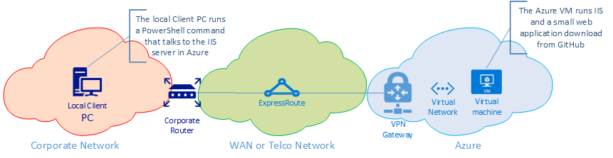

# Azure Hybrid Availability Tool

# This work is pre-release! It's close, but still a work in progress!

## Overview
This collection of server side web pages and local PowerShell scripts will generate, collect, store, and display availability statistics of the network between you and a newly built Windows VM on a Hybrid connected Network.

Is it designed to provide an indication, over time, of the link between an application server in Azure and an on-premise or remote network. The focus is on network performance, however the test is done from a PC client to an IIS server in Azure, thus providing a comprehensive view into total availability, not just a single point or compontent in the complex chain that makes up a hybrid network. This hope is that this will provide insight into the end-to-end network availability.

This tool **does not** provide rich insight if a problem is encountered during a test, over time this tool may improve but this initial release only reflects the statistics around availability seen while an active test is running.

## Tool Usage
### Prerequisites
This tool has three perquisites resources that must be in place before using:

1. An Azure VNet network with a hybrid connection (either VPN or ExpressRoute) connected to a remote (usually "on-prem") network
2. A newly created Azure VM, running Windows Server 2012 or greater, on the Azure VNet reachable from the on-prem network. The files and configuration of the server will be modified, potentially in disruptive ways. To avoid conflicts and/or errors it is important that the Azure VM used is newly built and a "clean" build with no other applications or data installed.
3. A client PC running PowerShell 3.0 or greater on the on-prem network that can reach (via RDP or Remote Desktop) the Azure VM

### Installation Instructions
1. Download the GitHub folders to your local client PC. The easiest way to this is to clone this repository to the local PC. If you're not familiar with Git or GitHub, there is a "[Download Zip](https://github.com/tracsman/HybridTool/archive/master.zip "Download Files Here")" button that will allow you to download all files and expand them on the local Client PC.
2. Remote Desktop to the newly built Azure VM running Windows Server:
	1. Copy the IISBuild.ps1 script from the ServerSide folder to the Azure VM.
	2. Open an elevated (i.e. "run as administrator") PowerShell prompt on the Azure VM.
	3. Run the IISBuild.ps1, this will turn on ICMP (ping), install IIS, .Net 4.5, and copy some IIS application files from GitHub. If any errors occur with the file copies, or your server doesn't have access to the Internet, the files can be manually copied. Copy all files from the ServerSide directory of this GitHub to the C:\Inetpub\wwwroot folder on the server. **Note**: If needed, this script can be run multiple times until all errors are resolved.
3. Note the local IP address of the Azure VM.
	- From PowerShell run: `(Get-NetIPAddress).IPv4Address`
	- Copy the first IP address, this should be the VNet IP address for your server. Note: it's not the 127.0.0.1 address.
4. On the local Client PC, open a web browser.
5. Goto `http://<IP Copied from Step 3>`; e.g. http://10.0.0.1
6. You should successful bring up a web page titled "Hybrid Availability Home Page". This validates that the web server was successfully set-up and reachable by the local PC. Note: Since the WebPing script hasn't been run, this web page will just be the framework with no real data in it yet. Don't worry, we're about to generate some data!

### Running the tool
1. On the local Client PC, open a PowerShell prompt.
2. Navigate to the directory where the GitHub files where copied in step 1 of the Installation Instructions above.
3. The main command is WebPing.ps1, this commandlet has four parameters:
	- **RemoteHost** - This is required and is the Azure VM local IP Address copied in step 1 of the Installation Instructions above.
	- **Duration** - This optional parameter signifies the duration of the WebPing command. The default value is 5. This can be 5 seconds or 5 minutes depending on the value of the DurationInterval parameter.
	- **DurationInterval** - This optional parameters signifies if your duration value will be in Minutes or Seconds. The valid values for this parameter are "Seconds" or "Minutes". The default option is "Seconds".
	- **TimeoutSeconds** - This optional parameter signifies how long each WebPing will wait for a response. The default value is 4 seconds.
4. For the first run, I recommend doing a test run of 5 seconds. To do this, in the PowerShell prompt run the following command: `.\WebPing.ps1 -RemoteHost <Azure VM IP>` ; e.g. .\WebPing.ps1 -RemoteHost 10.0.0.1
 
>Note: Data from each run of the WebPing commandlet will uploaded and be saved to the Azure VM. If there are errors uploading the data or the command is terminated before uploading, the data is stored locally on the PC until the next successful run of the WebPing commandlet. Uploaded data accumulates on the Azure VM and is selectable and displayed using the default page on the Azure VM.

### Tool Output
The WebPing commandlet will issue a call to a web page on the remote server (WebTest.aspx), based on the response either an error, a timeout, or a successful response, the script will then wait one second and try again. Each call will produce command line output to the PowerShell prompt of one of the following.

>**Possible Script Output**
>
>! - Successful WebPing
>
>. - Unsuccessful WebPing (timeout)
>
>\* - IP was reached but wrong data or error (e.g. 404) was returned

Each call to the web server is also recorded locally, in the %temp% directory, in two XML files.
-DiagJobHeader.xml
-DiagJobDetail.xml

At the end of the commandlet, a summary of the run will be output to the PowerShell prompt similar to ping results.

The XML files are also uploaded to the server and a web browser should open on the local client machine with the details of all WebPing jobs run against that server. If the WebPing run was successful, and the data successfully uploaded to the server, the local XML files will be deleted from the local Client PC. If any errors with the job or the data upload, the XML will remain on the local Client PC until a successful WebPing run.

### Data Presentation and Review
After running WebPing.ps1, a web page should open on the local PC, displaying WebPing data for all script runs.
The page can be opened at any time by opening a browser and navigating to `http://<Azure VM IP>` e.g. http://10.0.0.1.

The drop down on that page will show all the jobs (by data and time) contained in the XML files.

Selecting a specific job will display the graph and detailed tabular data for that run as well as the summary information.

### Other Tool Commandlets
There are two other commandlets that can be run:
- Clear-History.ps1 
- Show-Results.ps1

Both commandlets have a single input parameter:
- **RemoteHost** - This parameter is required for Show-Results and optional for Clear-History, for both commandlets this parameter is the IP Address of the Azure VM copied in step 1 of the Installation Instructions above.

#### Clear-History.ps1
This commandlet will delete any WebPing data on both the local PC and the remote Azure VM (if the server IP is provided). This commandlet is never required to be run, but can be helpfull if there are many entries in the downdown box or a new series of tests is about to be run.

#### Show-Results.ps1
This commandlet will open a web browser on the local Client PC to display the WebPing data saved to the remote Azure VM.

### Removing the Hybrid Availability Tool
Once testing is complete the Azure VM should be deleted to avoid unnecessary Azure usage (and associated charges) and all local files can be deleted. There is nothing permanently installed, only files copied from GitHub and potentially the two XML files in the Local Client PC. 

To ensure 100% removal of all artifacts from this tool perform the following steps:

1. Run the Clear-History.ps1 command from PowerShell (the Remote-Host parameter is optional and not required)
2. Delete all files on the local Client PC copied from GitHub
3. Delete the Azure VM

## History
2016-01-xx - Initial release, version 1.0.

## To Do (Backlog)

1. (WebPing.ps1) Check XML schema version, if not current, overwrite
2. (WebPing.ps1) Add Help switch and help information
3. (WebPing.ps1) Add ending stats if CRTL-C pressed in middle of job
4. (WebDiag.ps1) Net new commandlet, if WebPing fails, a simple troubleshooter
5. (DisplayPing.html) Make it prettier

## License
This tool incorporates [JQuery](https://jquery.org/license/ "JQuery License") for XML manipulation and is included in the ServerSide files. JQuery is included and used under the requirements of the MIT License, and in compliance with the main proviso "*You are free to use any jQuery Foundation project in any other project (even commercial projects) as long as the copyright header is left intact.*"
